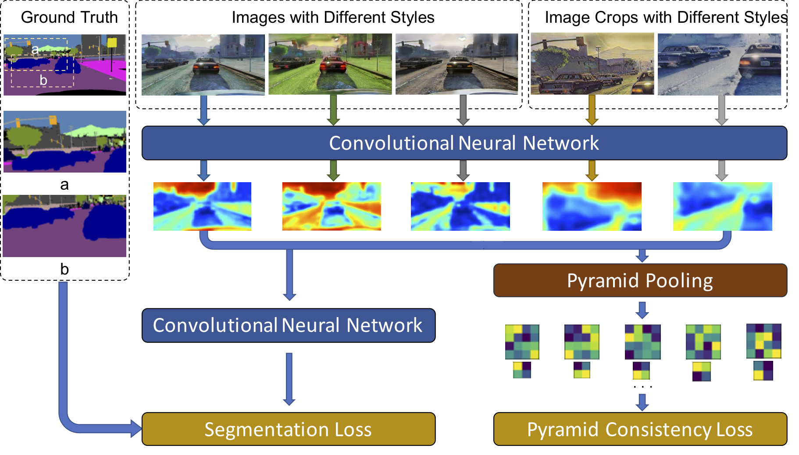

# DRPC

This is the PyTorch Implementation for our paper:

Domain Randomization and Pyramid Consistency: Sim-to-real Generalization without Accessing Target Domain Data

[Xiangyu Yue](https://people.eecs.berkeley.edu/~xyyue/), [Yang Zhang](https://yangzhang4065.github.io/), [Sicheng Zhao](https://sites.google.com/site/schzhao/home), [Alberto Sangiovanni-Vincentelli](https://people.eecs.berkeley.edu/~alberto/), [Kurt Keutzer](https://people.eecs.berkeley.edu/~keutzer/), [Boqing Gong](http://boqinggong.info/)

ArXiv link: [https://arxiv.org/abs/1909.00889](https://arxiv.org/abs/1909.00889)

**Abstract** 

We propose to harness the potential of simulation for the semantic segmentation of real-world self-driving scenes in a domain generalization fashion. The segmentation network is trained without any data of target domains and tested on the unseen target domains. To this end, we propose a new approach of domain randomization and pyramid consistency to learn a model with high generalizability. First, we propose to randomize the synthetic images with the styles of real images in terms of visual appearances using auxiliary datasets, in order to effectively learn domain-invariant representations. Second, we further enforce pyramid consistency across different "stylized" images and within an image, in order to learn domain-invariant and scale-invariant features, respectively. Extensive experiments are conducted on the generalization from GTA and SYNTHIA to Cityscapes, BDDS and Mapillary; and our method achieves superior results over the state-of-the-art techniques. Remarkably, our generalization results are on par with or even better than those obtained by state-of-the-art simulation-to-real domain adaptation methods, which access the target domain data at training time.

  

